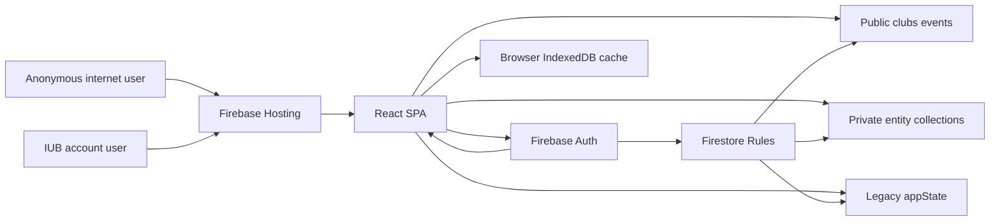

## Executive summary
This React/Vite SPA delegates production security to Firebase Auth and Firestore Rules, but the current rules intentionally allow any signed-in `@iub.edu.bd` identity to write every entity document and to read most private collections. The highest-risk themes are broken server-side authorization, broad PII exposure, unauthenticated legacy `appState/main` reads, unauthenticated check-in/registration integrity through direct SDK writes, and production demo/admin credential paths.

## Scope and assumptions
- In scope: runtime SPA, Firebase Auth, Firestore data access, Firestore Rules, Hosting headers, demo fallback paths, and client business logic under `src\app`.
- Out of scope: local developer tooling, Playwright demo tests, image optimization scripts, and Firebase Admin migration scripts except where they shape production state.
- Assumption: Firebase Hosting serves the built `dist` SPA and Firestore Rules in `firestore.rules` are deployed by Firebase configuration in `firebase.json:2-16`.
- Assumption: all privileged roles (`student`, `coordinator`, `club_admin`, `super_admin`) are currently fields inside Firestore `users` documents, not trusted custom claims (`src\app\lib\store.ts:37-46`).
- Assumption-validation note: the skill normally asks follow-up questions first, but this non-interactive task provided enough context; unresolved questions are recorded here instead.
- Open question: are Firebase Email/Password accounts required to verify email before use in the deployed Firebase project?
- Open question: has `appState/main` been deleted after migration, or can anonymous users still fetch historic snapshots?
- Open question: is any App Check enforcement enabled in Firebase Console, since no client initialization was found in `src\app\lib\firebase.ts`?

## System model
### Primary components
- Browser SPA: React 18, TypeScript, Vite, React Router, lazy-loaded pages, and client-side reducers (`package.json:6-17`, `package.json:22-42`, `src\app\App.tsx:90-245`).
- Firebase Hosting: serves `dist`, rewrites unknown routes to `/index.html`, and sets security/cache headers (`firebase.json:6-55`).
- Firebase Auth: email/password plus Google popup, restricted in client code to `@iub.edu.bd` suffix (`src\app\services\authService.ts:53-67`, `src\app\services\authService.ts:115-157`).
- Firebase client initialization: Vite `VITE_FIREBASE_*` web config, IndexedDB/browser persistence, Firestore persistent cache (`src\app\lib\firebase.ts:32-55`, `src\app\lib\firebase.ts:61-88`).
- Cloud Firestore: per-entity collections `users`, `clubs`, `events`, `registrations`, `memberships`, `notifications`, `roleRequests` plus legacy `appState/main` (`src\app\services\firestore.ts:1-25`, `firestore.rules:5-10`).
- Client store assembly: one `onSnapshot` listener per collection reassembles `StoreState`; denied slices are placeholders (`src\app\services\firestore.ts:116-220`).
- Client persistence: `persistStoreDiff` computes changed entity docs and commits `writeBatch` sets/deletes (`src\app\services\firestore.ts:229-288`).
- Legacy fallback: migration reads/writes `appState/main`; fallback whole-snapshot writes remain in `stateService` (`src\app\services\firestore.ts:290-307`, `src\app\services\stateService.ts:1-37`).

### Data flows and trust boundaries
- Internet user -> Firebase Hosting: HTML/JS/CSS/assets over HTTPS; Hosting rewrites SPA routes and sets `nosniff`, `X-Frame-Options`, referrer, and permissions headers, but no CSP is configured (`firebase.json:17-55`).
- Browser SPA -> Firebase Auth: email, password, Google profile, Auth tokens over Firebase SDK/TLS; client checks only domain suffix, Google `hd`, and returned email suffix (`src\app\services\authService.ts:53-67`, `src\app\services\authService.ts:148-151`).
- Browser SPA -> Firestore public collections: anonymous reads of `clubs` and `events`; writes require `isIubUser()` and matching `id` field only (`firestore.rules:33-56`).
- Browser SPA -> Firestore private collections: any signed-in `@iub.edu.bd` user can read/write users, registrations, memberships, notifications, and roleRequests if doc id matches payload id (`firestore.rules:58-79`).
- Browser SPA -> legacy `appState`: anonymous reads and signed-in writes are allowed for every `appState/{docId}` (`firestore.rules:81-88`).
- Firestore snapshots -> React state: untrusted database content is rendered by React text escaping; no `dangerouslySetInnerHTML`/`eval` use was found by search, but no CSP reduces XSS blast-radius (`src\app\services\firestore.ts:196-220`, `firebase.json:17-55`).
- Client actions -> reducers -> Firestore: route guards and reducers enforce business intent locally, then persist diffs; Firestore does not repeat the role/ownership checks (`src\app\components\ProtectedRoute.tsx:25-28`, `src\app\context\Providers.tsx:216-260`).

#### Diagram


## Assets and security objectives
| Asset | Why it matters | Security objective (C/I/A) |
|---|---|---|
| Firebase Auth sessions and persistence | IndexedDB/browser persistence keeps users signed in and grants Firestore access (`src\app\lib\firebase.ts:71-73`). | C/I |
| User identities and roles | `role` drives privileged UI and post-login route targets (`src\app\lib\store.ts:37-46`, `src\app\context\AuthContext.tsx:6-18`). | I |
| Student PII | `users` include email/student_id/department; registrations and memberships include contact email/phone/motivation (`src\app\lib\store.ts:37-46`, `src\app\lib\store.ts:87-122`). | C/I |
| Event and club records | Public-facing campus schedule and club ownership; deletions cascade in client reducers (`src\app\lib\store.ts:63-85`, `src\app\lib\store.ts:1362-1377`). | I/A |
| Registrations and waitlists | Capacity, attendance, and student participation records (`src\app\lib\store.ts:87-99`, `src\app\lib\store.ts:1088-1158`). | C/I/A |
| QR check-in state | Check-in codes are deterministic `CHK|eventId|registrationId` and mark attendance (`src\app\lib\eventUtils.ts:150-164`, `src\app\lib\store.ts:1160-1183`). | I |
| Notifications | Used for membership, registration, event update, and role request messaging (`src\app\lib\store.ts:124-133`, `src\app\lib\store.ts:1117-1125`). | I/C |
| Role requests | Promotion/club-creation workflow and student messages (`src\app\lib\store.ts:135-149`, `src\app\lib\store.ts:1495-1644`). | I/C |
| Legacy appState snapshot | May contain the full StoreState in one public-readable document (`src\app\services\stateService.ts:16-37`, `firestore.rules:81-88`). | C/I |
| Firebase web config | Public bundle config is not a secret, but API restrictions and rules must carry security (`.env.example:6-18`, `src\app\lib\firebase.ts:32-43`). | I/A |

## Attacker model
### Capabilities
- Anonymous internet user can load the SPA, read public `clubs`/`events`, and read `appState/{docId}` under current rules (`firestore.rules:48-56`, `firestore.rules:81-88`).
- Authenticated IUB student can obtain a Firebase Auth session and use Firebase SDK/REST directly, bypassing route guards and reducers.
- Malicious club admin/coordinator can use privileged UI for their role and direct SDK writes outside their club scope because rules do not scope writes.
- Compromised account inherits all Firestore read/write power granted to any signed-in IUB email.
- XSS attacker can execute as the victim in the SPA origin, access Firebase SDK state, and write through the victim session; missing CSP increases blast radius.

### Non-capabilities
- Attackers are not assumed to control Firebase Admin SDK, Firebase Hosting deployment, or Firestore Rules deployment.
- Attackers are not assumed to break TLS, Firebase Auth token signatures, or Google/Firebase infrastructure.
- Anonymous attackers cannot write the per-entity collections without an Auth token, under the current rules.
- Direct DOM XSS was not confirmed in source search; this model treats XSS as a high-impact capability if introduced through future UI/content changes.

## Entry points and attack surfaces
| Surface | How reached | Trust boundary | Notes | Evidence (repo path / symbol) |
|---|---|---|---|---|
| SPA routes | Browser navigation | Internet -> Hosting -> SPA | ProtectedRoute gates UI by currentUser and role only. | `src\app\App.tsx:99-239`, `src\app\components\ProtectedRoute.tsx:18-31` |
| Email/password signup | Register page/AuthService | Browser -> Firebase Auth | Accepts any `@iub.edu.bd` suffix; no email verification check in code/rules. | `src\app\services\authService.ts:115-122`, `firestore.rules:33-37` |
| Google login | AuthService popup | Browser -> Google/Firebase Auth | Uses `hd=iub.edu.bd` and checks returned suffix. | `src\app\services\authService.ts:59-67`, `src\app\services\authService.ts:129-157` |
| Firestore collection listeners | `subscribeStore` | Browser -> Firestore | Reads all entity collections into StoreState when rules permit. | `src\app\services\firestore.ts:116-220` |
| Firestore diff writes | `persistStoreDiff` | Browser -> Firestore | Batch set/delete for any changed entity doc. | `src\app\services\firestore.ts:241-288` |
| Users collection | SDK/REST | Auth user -> Firestore | Any IUB user can read/write any user doc. | `firestore.rules:60-63`, `src\app\lib\store.ts:1646-1676` |
| Registrations collection | SDK/REST and forms | Auth user -> Firestore | Contains contact fields and check-in flags. | `firestore.rules:64-67`, `src\app\lib\store.ts:87-99` |
| Memberships collection | SDK/REST and forms | Auth user -> Firestore | Contains phone, email, motivation, role, permissions. | `firestore.rules:68-71`, `src\app\lib\store.ts:101-122` |
| Notifications collection | SDK/REST | Auth user -> Firestore | Any signed-in IUB user can forge/delete messages. | `firestore.rules:72-75`, `src\app\lib\store.ts:124-133` |
| RoleRequests collection | SDK/REST | Auth user -> Firestore | Promotion workflow is writable by any IUB user. | `firestore.rules:76-79`, `src\app\lib\store.ts:1495-1644` |
| Legacy appState | SDK/REST document read | Anonymous/Auth -> Firestore | Public read, signed-in write, possible full snapshot. | `firestore.rules:81-88`, `src\app\services\stateService.ts:16-37` |
| Demo credential fallback | AuthService login | Browser -> Firebase Auth | Known demo credentials can create missing Auth accounts in configured mode. | `src\app\services\authService.ts:46-50`, `src\app\services\authService.ts:76-103` |

## Top abuse paths
1. Privilege escalation: sign in as any accepted IUB-domain account -> call Firestore SDK to update own `users/{id}.role` to `super_admin` -> SPA derives role from StoreState -> gain superadmin UI and can call more mutations.
2. Global data destruction: sign in -> enumerate readable collections -> issue deletes against `events`, `clubs`, `registrations`, `memberships`, `notifications`, and `roleRequests` -> rules allow deletes via `canWrite` without owner/role checks.
3. PII harvesting: sign in -> listen to `users`, `registrations`, `memberships`, and `roleRequests` -> export student ids, emails, phones, motivations, attendance, and role requests.
4. Anonymous legacy exposure: no account -> read `appState/main` or any `appState/{docId}` -> recover historic StoreState if the document still contains snapshot data.
5. Registration tampering: sign in -> add/delete registration docs and adjust event counters -> overbook events, remove attendees, or forge participation history.
6. Check-in fraud: sign in -> set `checked_in=true`/`checked_in_at` on arbitrary registrations or guess deterministic QR codes -> falsify attendance.
7. Notification forgery: sign in -> create notifications for other users/admins -> social-engineer role approvals, event cancellations, or membership outcomes.
8. Demo admin takeover: use known seeded demo admin credential against Firebase Auth when account is missing -> hotfix path creates the Auth account -> if matching seeded/user doc exists, operate as super admin.
9. XSS session abuse: inject script through any future rich content field -> use persisted Auth/Firestore session to read/write all collections allowed to victim; no CSP limits script sources.

## Threat model table
| Threat ID | Threat source | Prerequisites | Threat action | Impact | Impacted assets | Existing controls (evidence) | Gaps | Recommended mitigations | Detection ideas | Likelihood | Impact severity | Priority |
|---|---|---|---|---|---|---|---|---|---|---|---|---|
| TM-001 | Authenticated IUB student | Firebase account with `@iub.edu.bd` email; direct SDK/REST access. | Update `users` role fields or roleRequests to gain admin powers. | Full integrity compromise of roles, clubs, events, registrations, notifications. | User roles, admin workflows, all collections. | UI route checks only (`src\app\components\ProtectedRoute.tsx:25-28`); rules admit all IUB writes (`firestore.rules:44-79`). | No trusted server-side role source; `role` mutable by clients. | Move roles to custom claims or server-only `userRoles`; deny client role changes; enforce per-collection rules. | Alert on role field changes, new super_admins, bulk writes by non-admin claims. | High: direct SDK bypass is trivial after login. | High: full app takeover. | critical |
| TM-002 | Authenticated IUB student or compromised account | Any accepted IUB Auth token. | Read all private collections and export PII. | Campus participation and contact data disclosure. | Student PII, registrations, memberships, roleRequests. | Anonymous users denied for private entities (`firestore.rules:58-79`). | All signed-in IUB users can read all records, not just own/managed records. | Scope reads to owner, club admins/coordinators, and super_admins; separate public event data from private rosters. | Firestore read-volume anomaly alerts; export-like query patterns by normal students. | High: rules intentionally permit reads. | High: phone/email/student data exposed. | critical |
| TM-003 | Anonymous internet user | Legacy document still populated. | Read `appState/main` because `appState/{docId}` is public. | Full historic StoreState disclosure, possibly including PII and roles. | Legacy snapshot, PII, roles. | TODO comments acknowledge migration use (`firestore.rules:81-88`). | Public read remains after migration; no doc-id restriction to `main`. | Delete legacy data; set `allow read, write: if false`; remove whole-snapshot fallback. | Monitor reads on `appState/*`; verify document deleted in Firebase Console. | Medium: depends on document contents/existence. | High if snapshot contains private data. | high |
| TM-004 | Authenticated IUB student | Any accepted IUB Auth token. | Delete or overwrite collections in bulk. | Event platform outage, lost registrations/memberships, broken dashboards. | Availability and integrity of Firestore state. | Firestore batch limit only creates operational friction (`src\app\services\firestore.ts:66-67`, `src\app\services\firestore.ts:273-285`). | Deletes allowed by `canWrite` for all signed-in users (`firestore.rules:44-46`). | Restrict deletes to super_admin/own records; use soft deletes and audit logs; backups/PITR. | Alert on high delete counts, event/club cardinality drops, unusual write rates. | High: same rule gap as writes. | High: broad data loss. | critical |
| TM-005 | Authenticated IUB student or malicious club admin | Direct SDK writes; event/registration IDs known from readable data. | Forge registrations, counters, waitlist state, and check-in fields. | Overbooking, fraudulent attendance, operational disruption. | Registrations, event counters, check-in records. | Client reducers check duplicates/capacity/check-in UI (`src\app\lib\store.ts:1088-1183`, `src\app\pages\AttendeeRosterPage.tsx:114-143`). | Reducer checks are not enforced by rules; QR code is deterministic (`src\app\lib\eventUtils.ts:150-164`). | Rules: owner-only registration create/update, event-admin-only check-in, server-computed counters/transactions, signed random QR token. | Compare counters to registration counts; alert on check-ins outside event window or by non-admin claim. | High: IDs are readable and writes are open. | Medium-high: integrity and availability harm. | high |
| TM-006 | Authenticated IUB student | Ability to write notifications. | Forge notifications to admins/users or erase notices. | Social engineering, confusion, hidden approvals/cancellations. | Notifications, user trust, role workflow. | Notification types are typed in client (`src\app\lib\store.ts:124-133`). | No sender/authenticity field or server-only generation. | Make notifications server-generated; allow users only to update their own `is_read`. | Alert on notification creates from client; include signed issuer metadata. | High: rules allow writes. | Medium: indirect but plausible workflow abuse. | high |
| TM-007 | External attacker or student with unverified email | Ability to create Firebase Auth email/password account. | Register arbitrary `*@iub.edu.bd` email and satisfy rules suffix check. | Non-IUB access to private Firestore collections. | Auth boundary, PII, Firestore data. | Client suffix check (`src\app\services\authService.ts:53-56`); rules suffix check (`firestore.rules:33-37`). | No `email_verified` rule requirement and no institutional ownership proof for email/password. | Require verified email in rules; prefer Google Workspace/SSO; disable public email/password signup or require admin approval. | Alert on unverified users accessing Firestore; audit Auth signups. | Medium-high unless Auth settings enforce verification externally. | High due PII/write access. | high |
| TM-008 | Internet/XSS attacker | Future XSS sink or malicious dependency executes script in SPA origin. | Use victim's persisted Firebase session to read/write Firestore. | Account-scoped or app-wide compromise under current broad rules. | Auth tokens, Firestore data. | React escaping and no found `dangerouslySetInnerHTML`/`eval`; Hosting headers include `nosniff`/frame controls (`firebase.json:17-25`). | No CSP; broad Firestore privileges magnify XSS. | Add strict CSP with nonces/hashes, Trusted Types where feasible, dependency review, and least-privilege rules. | CSP report-only endpoint; monitor impossible user actions. | Medium: no confirmed sink, but SPA evolves. | High under current rules. | high |
| TM-009 | Public user with demo/admin credential knowledge | Demo credential account absent or provisioned in production. | Login with known demo admin credential; hotfix creates account on failure. | Super-admin identity takeover if matching user doc is present. | Auth accounts, seeded admin user, roles. | Comment says demo only when unconfigured (`src\app\services\authService.ts:42-45`). | Configured-mode fallback still creates missing demo Auth accounts (`src\app\services\authService.ts:76-103`). | Remove demo credentials from production bundle; disable fallback behind build flag; rotate/delete demo accounts. | Alert on Auth login/create for demo emails; block known demo emails in production. | Medium: depends on account state. | High: seeded admin role exists (`src\app\lib\store.ts:184-190`). | high |
| TM-010 | Malicious club admin/coordinator | Legitimate elevated UI access or direct SDK. | Modify clubs/events/memberships outside assigned club. | Cross-club integrity failure and reputational harm. | Club ownership, events, memberships. | Client can compute managed clubs (`src\app\lib\store.ts:1072-1086`) and routes require roles (`src\app\App.tsx:162-215`). | Rules do not check club ownership/coordinator relationships. | Rules should check event.club_id -> club admin/coordinator claim; Cloud Functions for complex approvals. | Alert on writes where actor UID not linked to target club. | High for any elevated user. | Medium-high: cross-tenant-like campus impact. | high |

## Criticality calibration
- Critical: any signed-in student can become super_admin; any signed-in student can delete most collections; any authenticated user can read all private PII.
- Critical: vulnerabilities that turn a non-IUB or anonymous user into a signed-in IUB-equivalent account when private collections remain broadly readable/writable.
- High: legacy public `appState` exposure if populated; registration/check-in forgery; notification forgery that can drive privileged decisions.
- High: XSS that obtains Firebase session access while rules remain broad; malicious club admin crossing club boundaries.
- Medium: event/public club content defacement where private data and roles are not impacted; limited DoS mitigated by restore/backups.
- Medium: leakage of public events/clubs metadata already intended for anonymous browsing.
- Low: issues only affecting local demo mode without Firebase persistence; UI-only route confusion when rules correctly deny writes.
- Low: exposure of Firebase web API key by itself, because the repo documents Vite Firebase config as embedded public config (`.env.example:6-18`).

## Existing mitigations and gaps
- Mitigation: anonymous users can only read public clubs/events and legacy appState; private entity reads require `isIubUser()` (`firestore.rules:48-88`).
- Gap: `isIubUser()` is just email suffix and does not require `email_verified` (`firestore.rules:33-37`).
- Mitigation: ProtectedRoute redirects users whose stored role is not allowed for a page (`src\app\components\ProtectedRoute.tsx:25-28`).
- Gap: route guards are client-side; Firestore Rules do not use those roles for authorization (`firestore.rules:44-79`).
- Mitigation: Providers avoids using denied placeholder slices as write baselines, reducing accidental deletions after permission errors (`src\app\context\Providers.tsx:183-190`).
- Gap: once authenticated, all private slices are readable and writable, so this safety does not protect against malicious users.
- Mitigation: Hosting sends common hardening headers (`firebase.json:17-25`).
- Gap: no Content-Security-Policy or App Check initialization was found, so client abuse and XSS impact are not constrained.

## Prioritized recommendations
1. Replace client-trusted roles with trusted server-side authorization. Prefer Firebase Auth custom claims set by Cloud Functions/Admin SDK after approval; alternatively create `/userRoles/{uid}` documents written only by Admin SDK and never by clients.
2. Change user document IDs to `request.auth.uid` or maintain an immutable mapping from Auth UID to app user ID. Do not authorize by mutable `email` fields inside client-writable docs.
3. Require verified institutional identity in rules and Auth settings: `request.auth.token.email_verified == true` plus suffix, and prefer Google Workspace/SSO for `iub.edu.bd`.
4. Deny client writes to role fields, notification creation, event counters, and other derived state. Compute counters and notification fanout in Cloud Functions or transactionally validate invariants in rules.
5. Scope private reads: users can read self/minimal profiles; students can read own registrations/memberships/notifications/roleRequests; club admins/coordinators read only their club/event rosters; super_admins read global data.
6. Delete and lock `appState/main` after confirming migration; remove the legacy whole-snapshot fallback path or make it server-only.
7. Enable Firebase App Check enforcement for Firestore and initialize App Check in `src\app\lib\firebase.ts`; this is not authorization, but it reduces abuse from non-app clients.
8. Add a restrictive CSP in `firebase.json` (start Report-Only), including `script-src 'self'` plus required Firebase/Google endpoints, `object-src 'none'`, `base-uri 'self'`, and `frame-ancestors 'self'`.
9. Remove demo credentials and configured-mode auto-create fallback from production builds; rotate/delete any demo Firebase Auth accounts.
10. Add audit/detection: Cloud Logging exports for Firestore writes, alerts on role changes, high-volume deletes, public legacy reads, impossible check-ins, and writes outside actor's club scope.

### Example Firestore rule direction
```rules
function signedInIub() {
  return request.auth != null
    && request.auth.token.email_verified == true
    && request.auth.token.email.matches('.*@iub[.]edu[.]bd$');
}
function isSuperAdmin() { return signedInIub() && request.auth.token.role == 'super_admin'; }
function isClubAdmin(clubId) {
  return signedInIub()
    && (request.auth.token.role == 'super_admin'
      || (request.auth.token.role in ['club_admin', 'coordinator']
        && clubId in request.auth.token.club_ids));
}
match /users/{uid} {
  allow create: if signedInIub() && uid == request.auth.uid
    && request.resource.data.email == request.auth.token.email
    && request.resource.data.role == 'student';
  allow read: if signedInIub() && (uid == request.auth.uid || isSuperAdmin());
  allow update: if signedInIub() && uid == request.auth.uid
    && request.resource.data.diff(resource.data).affectedKeys()
      .hasOnly(['name','student_id','department','avatar','bio'])
    && request.resource.data.email == resource.data.email
    && request.resource.data.role == resource.data.role;
  allow update, delete: if isSuperAdmin();
}
match /events/{eventId} {
  allow read: if true;
  allow create: if isClubAdmin(request.resource.data.club_id);
  allow update, delete: if isClubAdmin(resource.data.club_id);
}
match /registrations/{regId} {
  allow create: if signedInIub() && request.resource.data.user_id == request.auth.uid;
  allow read: if signedInIub()
    && (resource.data.user_id == request.auth.uid || isClubAdmin(get(/databases/$(database)/documents/events/$(resource.data.event_id)).data.club_id));
  allow update: if isClubAdmin(get(/databases/$(database)/documents/events/$(resource.data.event_id)).data.club_id)
    && request.resource.data.diff(resource.data).affectedKeys().hasOnly(['checked_in','checked_in_at']);
  allow delete: if signedInIub() && resource.data.user_id == request.auth.uid;
}
match /memberships/{memId} {
  allow create: if signedInIub() && request.resource.data.user_id == request.auth.uid && request.resource.data.status == 'pending';
  allow read: if signedInIub() && (resource.data.user_id == request.auth.uid || isClubAdmin(resource.data.club_id));
  allow update, delete: if isClubAdmin(resource.data.club_id);
}
match /notifications/{notifId} {
  allow read: if signedInIub() && (resource.data.user_id == request.auth.uid || isSuperAdmin());
  allow update: if signedInIub() && resource.data.user_id == request.auth.uid
    && request.resource.data.diff(resource.data).affectedKeys().hasOnly(['is_read']);
  allow create, delete: if false;
}
match /roleRequests/{requestId} {
  allow create: if signedInIub() && request.resource.data.user_id == request.auth.uid && request.resource.data.status == 'pending';
  allow read: if signedInIub() && (resource.data.user_id == request.auth.uid || isSuperAdmin());
  allow update, delete: if isSuperAdmin();
}
match /appState/{docId} { allow read, write: if false; }
```

## Focus paths for security review
| Path | Why it matters | Related Threat IDs |
|---|---|---|
| `firestore.rules` | Primary server-side authorization boundary; currently grants broad reads/writes. | TM-001, TM-002, TM-003, TM-004, TM-010 |
| `src\app\services\authService.ts` | Auth suffix checks, Google login, demo credentials, configured-mode account creation. | TM-007, TM-009 |
| `src\app\lib\firebase.ts` | Firebase config, Auth persistence, Firestore cache, missing App Check initialization. | TM-008 |
| `src\app\services\firestore.ts` | Snapshot assembly, collection map, diff writes, legacy migration. | TM-002, TM-003, TM-004 |
| `src\app\context\Providers.tsx` | Maps Auth email to user records and exposes all write actions. | TM-001, TM-004, TM-005, TM-006 |
| `src\app\lib\store.ts` | Entity schemas, reducers, role changes, registrations, memberships, check-in, notifications. | TM-001, TM-005, TM-006, TM-010 |
| `src\app\components\ProtectedRoute.tsx` | UI-only role enforcement and redirect logic. | TM-001, TM-010 |
| `src\app\pages\AttendeeRosterPage.tsx` | QR parsing and check-in action path. | TM-005 |
| `src\app\lib\eventUtils.ts` | Deterministic QR code format. | TM-005 |
| `firebase.json` | Hosting headers and absence of CSP. | TM-008 |

## Quality check
- Covered entry points discovered: Hosting routes, Auth login/signup, Firestore listeners/writes, legacy appState, QR scan/check-in, demo fallback.
- Covered trust boundaries: Internet-to-Hosting, SPA-to-Auth, SPA-to-Firestore public/private/legacy, Firestore-to-React state, browser cache/session storage.
- Runtime vs CI/dev separation: production runtime is in scope; local tests/dev scripts are out of scope except demo fallback behavior bundled in runtime code.
- User clarification status: non-interactive execution; assumptions and open questions are explicitly listed.
- Evidence grounding: each major architectural/security claim includes repo path and line anchors.

## How to update this document
- Re-run this review whenever `firestore.rules`, Auth flows, `src\app\services\firestore.ts`, `src\app\context\Providers.tsx`, or data model types change.
- Update threat priorities after any move to custom claims, Cloud Functions, App Check enforcement, or scoped per-collection rules.
- Keep evidence anchors current by citing exact `path:line` ranges from the repository, and record unresolved assumptions in the Scope section.